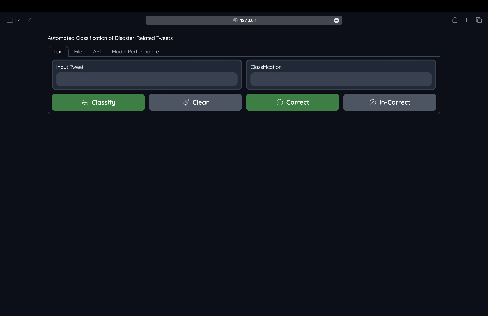
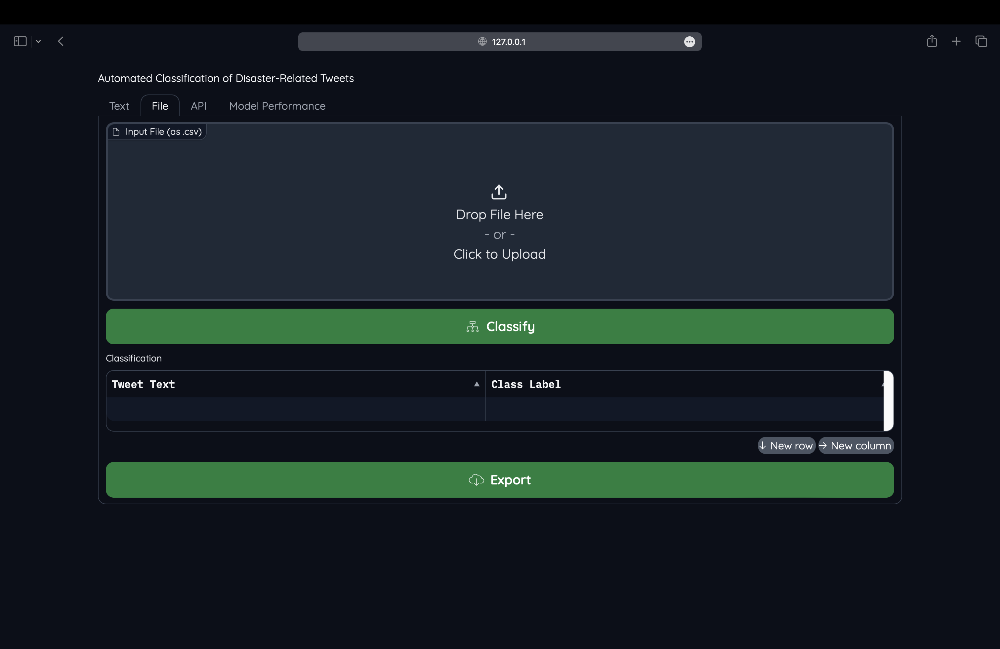
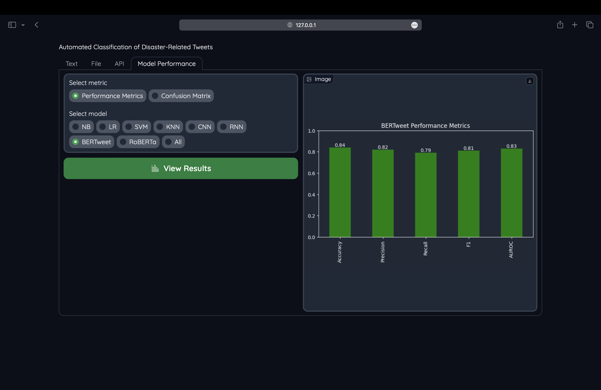

# Automated Classification of Disaster-Related Tweets 

## Pre-requisities

Python packages:

- Install the required packages by installing all the packages listed in [requirement.txt](requirement.txt) file or by executing below command

```
pip install -r requirement.txt
```

## Follow below steps
Follow below steps to train and test the model
1. Download the required packages listed in [requirement.txt](requirement.txt)

2. Run all the cells [main.ipynb](main.ipynb) notebook

3. Once execution is completed, navigate to the URL generted in last cell of the [main.ipynb](main.ipynb) notebook

4. To classify(disaster related or not related to disaster) single tweets, navigate to text menu and enter the text. Once text is entered, click classify. The output will be displayed below classification. You can provide feedback by clicking correct or incorrect button based on the classification output
 

5. To classify(disaster related or not related to disaster) list of tweets from the file, navigate to file menu and upload the file. Once file is uploaded click classify. The output will be displayed under classification. To export the classification output, click export


6. To view the performanc results of the model that was trained and tested, navigate to model performance and select the metric and model, then click view results

